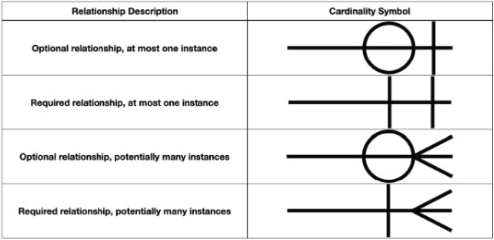

# Week 1

# Module 1: The Basics of Data
Data analytics is the collection, transformation, and organization of data in order to draw conclusions, make predictions, and drive informed decision making. It is a compelling subject that transcends industry boundaries. Data analytics can be branched into two primary components: conceptual understanding of data (theoretical aspect) and hands-on manipulation of data (practical aspect). 

## Chapter 1: The Data Analyst
The ultimate role of a data analyst is to transform raw data into actionable insights that guide decision-making processes within an organization.

**Key responsibilities and skills:**
1. Data Collection and Preparation:
   Sourcing data from various channels, including databases, spreadsheets, and external sources,
   Cleaning and organizing the data to ensure it is accurate, consistent, and ready for analysis.

2. Data Analysis:
   Employing statistical methods, machine learning techniques, or other analytic tools to interpret data,
   Identifying trends, patterns, and correlations that might not be immediately obvious.

3. Data Visualization and Storytelling:
   Creating visual representations of the data, such as charts, graphs, and dashboards, to make complex information easily understandable,
   articulating findings in a compelling narrative to communicate the significance of the data to stakeholders.

4. Decision Support:
   Making recommendations based on data-driven insights to help guide business decisions,
   Providing context around the data, including potential implications and future trends.

5. Collaboration and Communication:
   Working closely with other departments, such as marketing, finance, and operations, to understand their data needs and provide insights,
   Effectively communicating complex data findings in a clear and concise manner to non-technical stakeholders,

6. Continuous Learning and Adaptation: 

Keeping up-to-date with the latest industry trends, tools, and technologies in data analysis.
Adapting to new types of data and analytical methods as the organization's needs evolve.

Analytics is made possible by modern data, storage, and computing capabilities.
1. Data
2. Storage
3. Computing Power

**The analytics process**
The Analytics Process is Iterative. While we describe the steps of the analytics process as a series of sequential actions, it is more accurate to think of them as a set of interrelated actions that may be revisited frequently while working with a dataset.
1. Data Acquisition
2. Cleaning and Manipulation
3. Analysis
4. Visualization
5. Reporting and Communication

**Analytics Techniques**
Analysts use a variety of techniques to draw conclusions from the data at their disposal.
1. Descriptive Analytics
2. Predictive Analytics
3. Prescriptive Analytics

### Machine Learning, Artificial Intelligence, and Deep Learning

Data analytics is intellectually and computationally demanding therefore, you do not always have to do this work yourself; you can rely on automated techniques to help you unlock the hidden value in your data.

*Machine learning* uses algorithms to discover knowledge in your datasets that you can then apply to help you make informed decisions about the future. Machine learning (ML) is a subset of AI techniques. ML techniques attempt to apply statistics to data problems in an effort to discover new knowledge. 

*Artificial intelligence* (AI) includes any type of technique where you are attempting to get a computer system to imitate human behavior. As the name implies, you are trying to ask computer systems to artificially behave as if they were intelligent.

*Deep learning*is a further subdivision of machine learning that uses quite complex techniques, known as neural networks, to discover knowledge in a particular way. It is a highly specialized subfield of machine learning that is most commonly used for image, video, and sound analysis.

## Chapter 2: Understanding Data
### Exploring Data Types
A ***data element*** is an attribute about a person, place, or thing containing data within a range of values.
A ***data type*** limits the values a data element can have.

**Tabular Data**
Tabular data is data organized into a table, made up of columns and rows. A table represents information about a single topic. Each column represents a uniquely named field within a table, also called a variable, about a single characteristic. Spreadsheets, including Microsoft Excel, Google Sheets, and Apple Numbers, are practical tools for representing tabular data. 

**Structured Data Types**
Structured data is tabular in nature and organized into rows and columns.

- Numeric
- Whole Numbers
- Rational Numbers
- Date and Time
- Currency
- 
**Character**
The character data type limits data entry to only valid characters.

**Alphanumeric** 
This is the most widely used data type for storing character-based data. As the name implies, alphanumeric is appropriate when a data element consists of both numbers and letters.

**Unstructured Data Types**
Unstructured data is any type of data that does not fit neatly into the tabular model. Examples of unstructured data include digital images, audio recordings, video recordings, and open-ended survey responses.

- Binary
- Audio
- Images
- Video
- Large Text

### Categories of Data
Semi-structured data represents the space between structured spreadsheets and unstructured videos.

1. Quantitative vs. Qualitative Data
   Quantitative data consists of numeric values. Data elements whose values come from counting or measuring.
   Qualitative data consists of frequent text values. Data elements whose values describe characteristics, traits, and attitudes .  
3. Discrete vs. Continuous Data
   Discrete data epresents measurements that can't be subdivided, e.g if a fundraising organization sells chickens in half-chicken increments, you can buy 1.5 chickens. However, you can't buy .25 chickens.
   When you measure things like height and weight, you are collecting continuous data. While whole numbers represent discrete data, continuous data typically need a decimal point.
   *Discrete applies when counting while continuous applies when measuring.*
5. Categorical Data
   Text data with a known, finite number of categories is categorical.
7. Dimensional Data
   Dimensional modeling organizes data into fact tables and dimension tables. Fact tables store measurement data that is of interest to a business.
   Dimensions are tables that contain data about the fact.

### Common File Formats
**Text/Flat Files**
Consist of plain text and are limited in scope to alphanumeric data.
They can easily be opened regardless of platform or operating system.
A unique character known as a delimiter(e.g comma or tab ) facilitates transmitting structured data via a text file. The delimiter is the character that separates individual fields.
When a file is comma-delimited, it is known as a **comma-separated values (CSV)** file. Similarly, when a file is tab-delimited, it is called a **tab-separated values (TSV)** file.

**Fixed-Width Files**
Fixed-width files are more laborious to create since they require a few extra steps. 
The first row in a fixed-width file describes the column names. For the data rows, you first need to determine the maximum length of each column. Then, you must pad values that are shorter than the maximum length. For numeric fields, you accomplish padding by prepending a leading zero. For alphanumeric or text fields, this is done by prepending or appending spaces.

**JavaScript Object Notation**
JavaScript Object Notation (JSON) is an open standard file format, designed to add structure to a text file without incurring significant overhead. One of its design principles is that JSON is easily readable by people and easily parsed by modern programming languages.

**Extensible Markup Language (XML)**
Extensible Markup Language (XML) is a markup language that facilitates structuring data in a text file. While conceptually similar to JSON, XML incurs more overhead because it makes extensive use of tags. Tags describe a data element and enclose each value for each data element. While these tags help readability, they add a significant amount of overhead.

**Asynchronous JavaScript and XML (Ajax)**
AJAX allowed client applications, written in HTML, to retrieve data from a server asynchronously. Without having to wait for a server response, the speed with which dynamic web pages operated increased.

**HyperText Markup Language (HTML)**
HyperText Markup Language (HTML) is a markup language for documents designed to be displayed in a web browser. HTML pages serve as the foundation for how people interact with the World Wide Web. Similar to XML, HTML is a tag-based language. 

# Module 2: Data Preparation and Exploration
## Chapter 3: Databases and Data Acquisition
### Exploring Databases
**Database categories**
1. Relational
   Relational databases excel at storing and processing structured data.
   The relational model builds on the concept of tabular data. In the relational model, an entity contains data for a single subject.
3. Non-relational
   The need to interact with unstructured data is one of the reasons behind the rise of nonrelational databases.
   
**The entity relationship diagram (ERD)** is a visual artifact of the data modeling process. It shows the connection between related entities. 
**Cardinality** refers to the relationship between two entities, showing how many instances of one entity relate to instances in another entity. You specify cardinality in an ERD with various line endings. 

**Types of Relationships**
1. A unary relationship is when an entity has a connection with itself. For example, a unary relationship where a single manager has multiple employees.
2. A binary relationship connects two entities.
3. A ternary relationship connects three entities. For example, you might use a ticket entity to connect a venue, a performing artist, and a price.

### Relational Databases
Relational entities correspond to database tables, and entity attributes correspond to table columns. 
A **database schema** defines how data is organized within a relational database. It encompasses logical constraints such as table names, fields, data types, and the relationships between these entities. 
A **primary key** is one or more attributes that uniquely identify a specific row in a table.  
A **foreign key** is one or more columns in one table that points to corresponding columns in a related table.
Frequently, a foreign key references another table's primary key.
A **composite primary key** is a primary key with more than one column.

To pull data from a relational database table, you perform a query. You compose queries using a programming language called Structured Query Language (SQL).
A **join** uses data values from one table to retrieve associated data in another table, typically using a foreign key.

**Relational Database Providers**
Oracle is one of the most mature database platforms and was first released in 1979. Microsoft developed SQL Server, and the open source community created offerings including MySQL, MariaDB, and PostgreSQL. Amazon Web Services (AWS) developed Aurora, which is compatible with MySQL and PostgreSQL. Aurora is unique because it takes advantage of AWS's underlying cloud platform and is easy to scale. 

### Nonrelational Databases
A nonrelational database does not have a predefined structure based on tabular data. 

**Examples of nonrelational databases:**
1. Key-value
   Data is stored as a collection of keys and their corresponding values.
   A key must be globally unique across the entire database.
   Since there are no underlying table structures and few limitations on the data that can be stored, operating a key-value database is much simpler than a relational database. It also can scale to accommodate        many simultaneous requests without impacting performance. 
3. Document
   A document database is similar to a key-value database, with additional restrictions. In a key-value database, the value can contain anything. With a document database, the value is restricted to a specific        structured format.
5. Column family
   Column-family databases use an index to identify data in groups of related columns. 
7. Graph
   Graph databases specialize in exploring relationships between pieces of data.
   Graph models map relationships between actual pieces of data.

### Database Use Cases
Different business needs require different database designs. While all databases store data, the database's structure needs to match its intended purpose.
**Databases tend to support two major categories of data processing:**
1. Online Transactional Processing (OLTP)
   OLTP systems handle the transactions we encounter every day.
   Example transactions include booking a flight reservation, ordering something online, or executing a stock trade.
3. Online Analytical Processing (OLAP).

### Normalization
Normalization is a process for structuring a database in a way that minimizes duplication of data. 

## Chapter 4: Data Quality
## Chapter 5: Data Analysis and Statistics

# Module 3: Module 3: Data Analytics and Reporting
## Chapter 6: Data Analytics Tools
## Chapter 7: Data Visualization with Reports and Dashboards

# Module 4: Data Governance
## Chapter 8: Defining Data Governance

